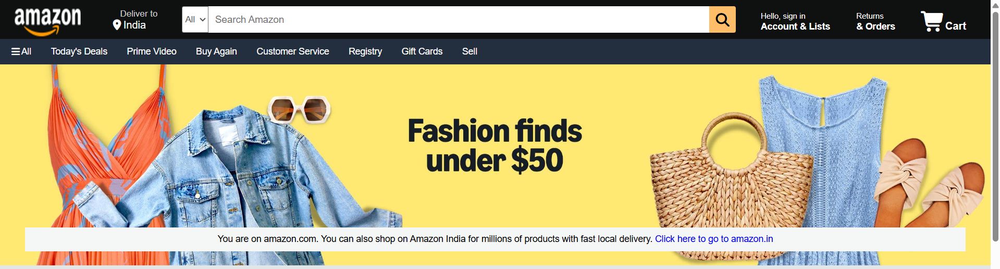
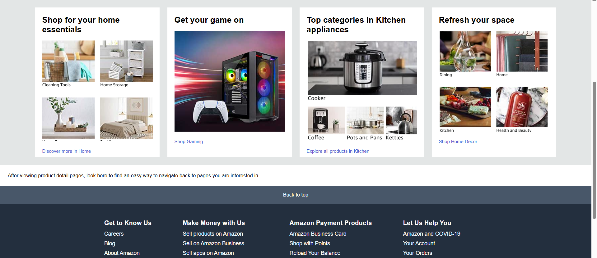

# Amazon Clone

A responsive front-end clone of the Amazon homepage built using **HTML, CSS, and Font Awesome**.  
This project replicates the layout and design of Amazon’s landing page to practice frontend development and UI design.

---

## 🚀 Live Preview

https://ishaansaxena2005.github.io/amazon-clone/

---

## 📸 Screenshots

### Homepage



### Product Section



---

## ✨ Features

- Amazon-style **navigation bar**
- Search bar with category dropdown
- Product category sections
- Hero banner section
- Responsive layout
- Footer with multiple information sections
- Hover effects for interactive elements

---

## 🛠 Tech Stack

- **HTML5**
- **CSS3**
- **Font Awesome Icons**

---

## 📁 Project Structure

```
amazon-clone/
│
├── index.html
├── style.css
├── images/
│   ├── amazon_logo.png
│   ├── hero_image.jpg
│   ├── shop1.png
│   ├── shop2.jpg
│   ├── shop3.png
│   └── shop4.png
│
└── screenshots/
    ├── homepage.png
    └── products.png
```

## ⚙️ How to Run

1. Clone the repository

```
git clone https://github.com/IshaanSaxena2005/amazon-clone.git
```

2. Open the project folder

3. Run

```
index.html
```

in your browser.

---

## 🎯 Purpose of the Project

This project was built to practice:

- Frontend layout design
- CSS Flexbox
- UI cloning of real-world websites

---

## 👨‍💻 Author

**Ishaan Saxena**

B.Tech CSE (Big Data Analytics)  
SRM Institute of Science and Technology KTR

---

⚠️ This project is for **educational purposes only** and is not affiliated with Amazon.
